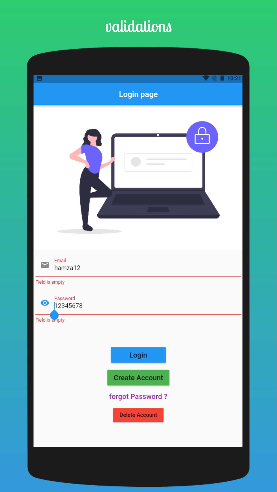
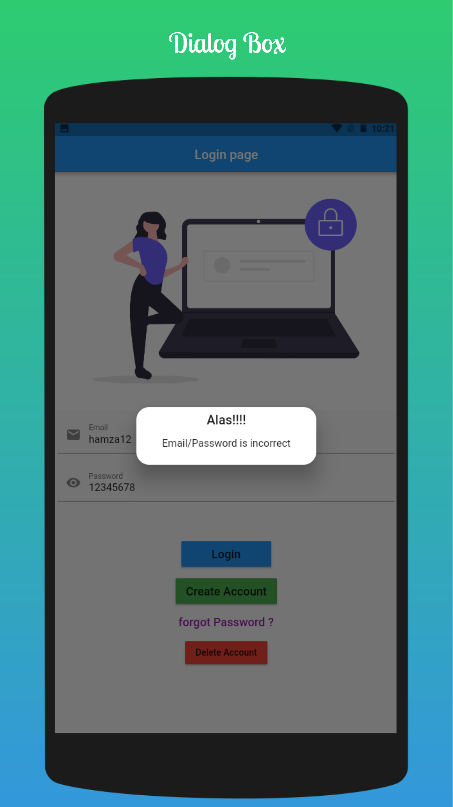
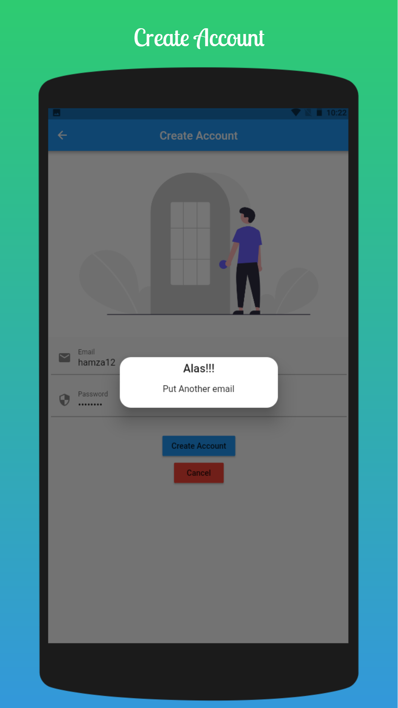
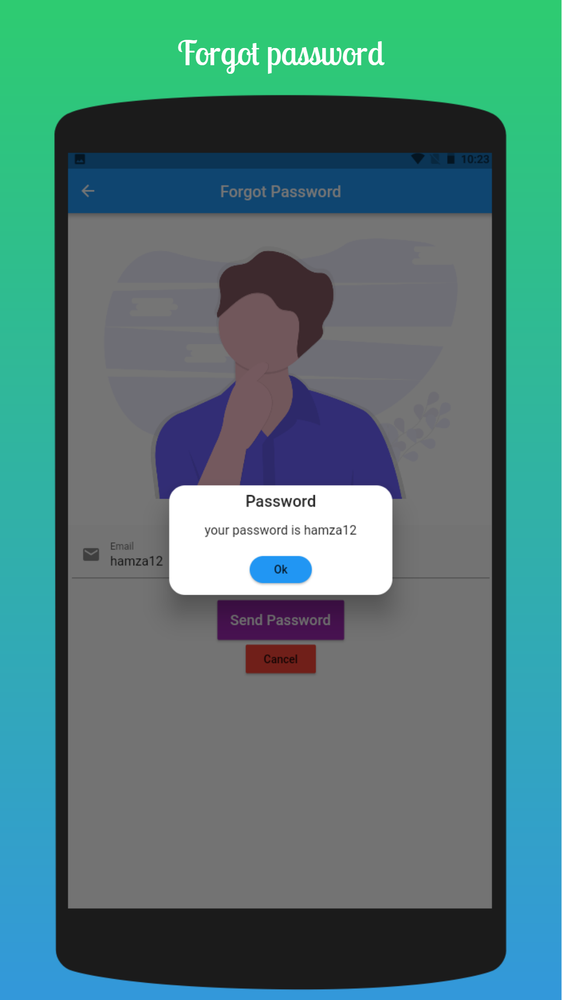
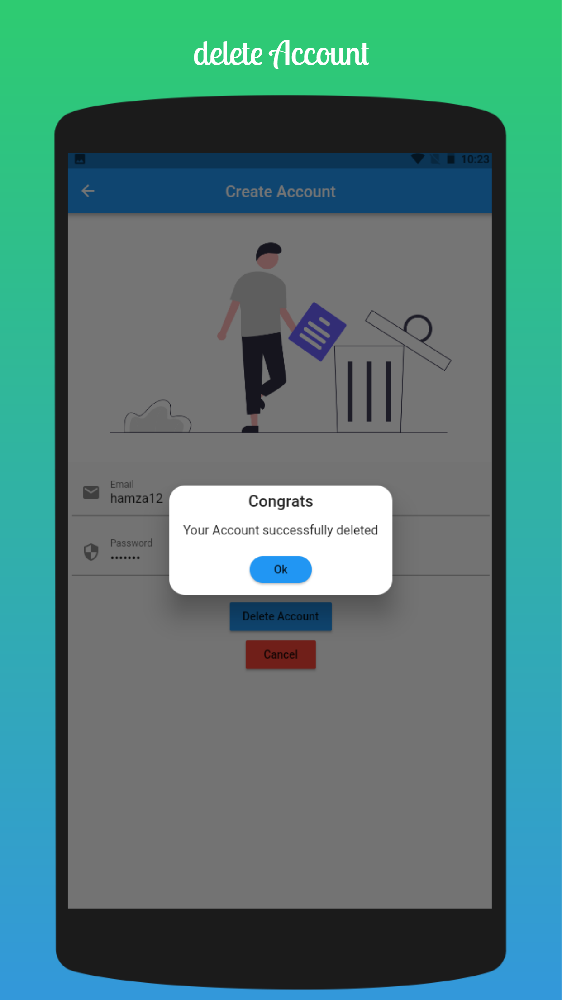

# login

### In this application login functionality is cleared locally with shared_preferences package.
### Emails and passwords stored locally without any authentication service provider or Database.
### Alog with random gerated picture from network.

[Created By Hamza Tarique](https://github.com/Mehar-IT)

|                                            |                                            |
|--------------------------------------------|--------------------------------------------|
|  |  |
|  |  |
|  |  |
|  |  |